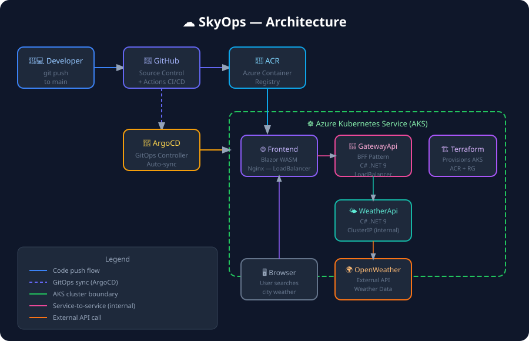

# SkyOps ☁️

> A production-grade, cloud-native weather platform — built to demonstrate a real-world Azure DevOps workflow end to end.



[](https://github.com/joshwavetti/skyops/actions/workflows/ci.yml)


---

## What is this?

SkyOps is a containerized, microservices-based weather dashboard deployed on **Azure Kubernetes Service (AKS)**. The app itself is intentionally simple — the point is the infrastructure around it: immutable Docker images, GitOps-driven deployments via ArgoCD, Terraform-provisioned Azure resources, and a fully automated GitHub Actions CI pipeline.

This repo is the evolution of an earlier [Azure DevOps CI prototype](https://github.com/joshwavetti/azure-cicd-pipeline-demo), where I first worked out self-hosted agents and ACR integration. SkyOps takes that foundation and builds a complete, production-shaped system on top of it.

---

## Architecture

The system follows a **Backend-for-Frontend (BFF)** pattern to keep the public API surface minimal and the frontend decoupled from internal service changes.

```
Browser (Blazor WASM)
        │
        ▼
  GatewayApi  ◄── Azure LoadBalancer (public)
  (BFF layer)
        │
        ▼
  WeatherApi  ◄── ClusterIP (internal only)
        │
        ▼
  OpenWeatherMap API
```

| Service | Technology | Role |
|---|---|---|
| `frontend` | Blazor WASM + Nginx | UI served as static files |
| `gateway-api` | C# .NET 9 Minimal API | Single public entry point, request aggregation |
| `weather-api` | C# .NET 9 Minimal API | Fetches and caches weather data |

**Why BFF?** The frontend only talks to one endpoint. Internal services stay behind a ClusterIP and are never exposed directly — a pattern common in production microservices environments.

---

## Tech Stack

| Layer | Technology |
|---|---|
| Backend | C# .NET 9 Minimal API |
| Frontend | Blazor WebAssembly |
| Containerization | Docker, Docker Compose |
| Container Registry | Azure Container Registry (ACR) |
| Orchestration | Kubernetes on AKS |
| Infrastructure | Terraform (IaC) |
| GitOps / CD | ArgoCD |
| CI Pipeline | GitHub Actions |
| Cloud | Microsoft Azure |

---

## CI/CD Pipeline

A push to `main` triggers a fully automated pipeline with no manual steps:

```
git push → main
    │
    ▼
GitHub Actions
    ├── Build 3 Docker images in parallel
    ├── Push tagged images to Azure Container Registry
    └── Update image tags in k8s manifests → commit back to repo
                │
                ▼
            ArgoCD (polling)
                └── Detects manifest change → syncs to AKS cluster
```

**Why GitOps (ArgoCD) instead of `kubectl apply` in CI?**
The Kubernetes cluster is the source of truth for what is *running*. The Git repo is the source of truth for what *should* run. ArgoCD continuously reconciles the two — meaning drift is detected and corrected automatically, and every deployment is fully auditable in version history.

---

## Repository Structure

```
skyops/
├── src/
│   ├── WeatherApi/           # Weather data microservice
│   ├── GatewayApi/           # BFF gateway
│   └── Frontend/             # Blazor WASM app
├── infra/
│   └── terraform/            # AKS cluster, ACR, resource group
├── k8s/
│   ├── weather-api/          # Deployment, Service manifests
│   ├── gateway-api/          # Deployment, Service manifests
│   ├── frontend/             # Deployment, Service manifests
│   └── argocd/               # ArgoCD Application definition
├── .github/
│   └── workflows/
│       └── ci.yml            # GitHub Actions pipeline
├── docker-compose.yml        # Local development stack
└── docs/
    └── architecture.svg
```

---

## Running Locally

**Prerequisites:** .NET 9 SDK, Docker Desktop, free [OpenWeatherMap API key](https://openweathermap.org/api)

```bash
git clone https://github.com/joshwavetti/skyops.git
cd skyops
```

Add your API key to `src/WeatherApi/appsettings.Development.json`:

```json
{
  "OpenWeather": {
    "ApiKey": "your_api_key_here"
  }
}
```

```bash
docker-compose up --build
```

Open **http://localhost:5151**

---

## Deploying to Azure

**Prerequisites:** Azure CLI, Terraform ≥ 1.6, kubectl

```bash
# 1. Authenticate
az login

# 2. Provision AKS + ACR with Terraform
cd infra/terraform
terraform init
terraform apply

# 3. Configure kubectl
az aks get-credentials --resource-group rg-skyops --name aks-skyops

# 4. Store the API key as a K8s secret
kubectl create secret generic weather-secret --from-literal=api-key=YOUR_API_KEY

# 5. Install ArgoCD and register the app
kubectl create namespace argocd
kubectl apply -n argocd -f https://raw.githubusercontent.com/argoproj/argo-cd/stable/manifests/install.yaml
kubectl apply -f k8s/argocd/skyops-app.yaml
```

From here, every push to `main` deploys automatically. No further manual steps.

---

## Cost Management

Designed to run cheaply on an Azure student/pay-as-you-go subscription:

- Single-node AKS cluster (`Standard_B2ls_v2`)
- Basic tier ACR
- `terraform destroy` tears everything down completely when not in use
- `terraform apply` restores the full environment in ~10 minutes

---

## Challenges & Lessons Learned

**ArgoCD image tag reconciliation** — ArgoCD manages declarative state, but CI needs to write new image tags back into the manifests. The solution was having GitHub Actions commit the updated tags directly to the repo, which ArgoCD then picks up on its next sync cycle. This keeps CI and CD cleanly separated.

**AKS + ACR authentication** — Rather than using admin credentials, the AKS kubelet identity is granted the `AcrPull` role via Terraform. No secrets stored, no rotation needed.

**Student subscription region limits** — Azure Portal filters out valid regions on student subscriptions. Worked around by provisioning via Azure CLI with explicit `--location` and `--size` flags, which bypasses the portal's restrictions entirely.

---

## License

MIT
